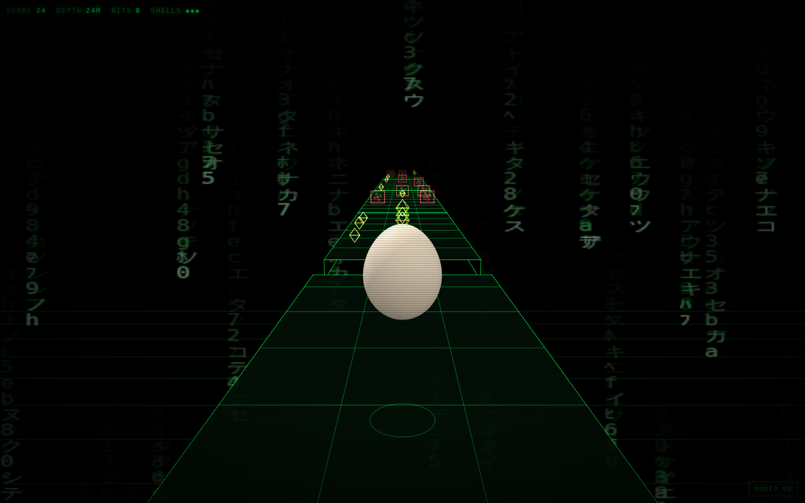
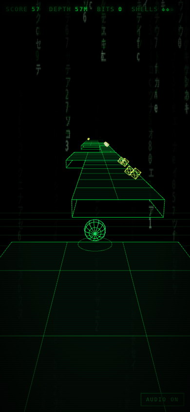

# Eggscape the Matrix

The egg got out. Everything on the other side is wireframe and green.

A 3D runner-platformer in the browser: roll east down a course that builds
itself, jump the holes, weave the agents, take the bits.

The egg is [Marc's](https://github.com/h1ddenpr0cess20/marc), as he is — the
same 128×96 shell through the same `shapeEgg` profile, the same 900-speckle
cream skin, the same physical material with its clearcoat and sheen, lit by his
studio rig. He is the only thing in here that is not made of lines, which is the
point.

He stays upright, too. The silhouette — fat end down, narrow end up — is the
asset, so he rocks and turns on the spot instead of tumbling end over end, and
the squash spring is allowed to flatten him but barely to stretch him.



## Run

```sh
git clone https://github.com/h1ddenpr0cess20/eggscape
cd eggscape
npm install
npm run dev               # → http://localhost:5173
```

No API keys, no server, no account. It is a static page and three.js.

## Play

| | |
|---|---|
| `A` `D` / `←` `→` | one lane, per press |
| `W` / `↑` / `space` | jump — again in the air for a flip |
| `S` / `↓` | slam down — onto an agent to break it |
| `M` | audio |

On a phone: swipe for a lane, flick up to jump, flick down to slam, tap for a
jump.

Three shells. An agent costs one, so does the void, and either way the egg is
put back down and keeps going until the last one. A metre is a point, a bit is
twenty-five, and an agent you come down on — in the air, slam on — is sixty and
one fewer agent. Speed climbs with distance, so the course gets harder because
you are getting faster, and the gaps grow to match.

The slam is the only move that answers back. Jump over an agent, put it on, and
the landing goes through the deck and takes the agent in that lane with it —
your lane only, and only a couple of metres of it, so it has to be aimed.

<p align="center">
  
</p>

## How it holds together

The run is a plain object graph with no pixels in it — course, egg, lives,
score — and the renderer reads a snapshot of it every frame. Nothing in
`src/core/` imports three.js or touches the DOM, which is why a seed can be
played out headlessly in a test and asserted on.

```
index.html            Markup only — Vite's entry
src/
  main.js             The wiring, and nothing else
  styles.css          The HUD, and the CRT it pretends to be on
  core/               The game. No three.js, no DOM, no randomness it did not seed
    game.js             Lives, score, pickups, and real seconds → fixed ticks
    course.js           The course, laid a pattern at a time, ahead of the egg
    player.js           Gravity, lanes, jump, coyote time, landings
    tuning.js           Every number the run is tuned by — the course reads it too
    shape.js            Marc's egg profile, verbatim
    rng.js              A seeded stream, so a seed is a course
    motion.js           The spring and the chase everything eases on
    emitter.js
  render/             three.js. Reads snapshots, owns no game state
    scene.js            Renderer, camera, fog, backdrop, and the light for the egg
    view.js             Snapshot → scene graph, and the chase camera
    rig.js              Where that camera sits and what it looks at, as arithmetic
    egg.js              Marc, fitted to the collider
    shell.js            His geometry and material, carried over as they are
    skin.js             His speckled cream, painted onto a canvas
    environment.js      His studio, turned down and turned green
    props.js            Slabs, agents, bits, and the grid under the void
    rain.js             The backdrop, painted on a canvas
    materials.js        Four shared line materials
    theme.js            One colour, and the two warnings
  ui/
    hud.js              The readouts and the panel between runs
    input.js            Keys and swipes → one frame of intent
    sound.js            Four oscillators' worth of arcade
    best.js             The only thing that survives a run
test/                 node:test, including an autopilot that proves seeds are fair
```

The generator never lays a gap wider than the jump that has to clear it, or a
step higher than the jump can rise: both come out of the same `tuning.js` the
physics uses, and the tests check every seed against them. Slabs never overlap
in z, so there is no wall to run into — miss a jump and you meet the void,
which is a fair thing to lose to.

One number in there is worth the warning it carries. `laneX` *descends* — lane
0 sits at the highest x — because the egg runs towards +z and the camera chases
it from behind, looking the same way, which mirrors the picture: world +x draws
on the left of the screen. Written the intuitive way round, every lane control
is backwards and nothing in the core notices. `test/rig.test.js` projects a
lane through the real rig and checks which half of the frame it lands on, which
is the only place the mistake is visible.

There is also an autopilot in `test/helpers/pilot.js`. It plays badly on
purpose — one frame of lookahead, no double jump — and the suite fails if it
cannot get a few hundred metres down a seed.

| Script | |
|---|---|
| `npm run dev` | Vite |
| `npm run build` | Bundles to `dist/` |
| `npm run preview` | Serves the build |
| `npm test` | `node:test` over the core, the HUD and the page |
| `npm run lint` | ESLint |

CI runs the lint, the tests on Node 22.12 and 24, and a build that then has to
boot and serve itself.
