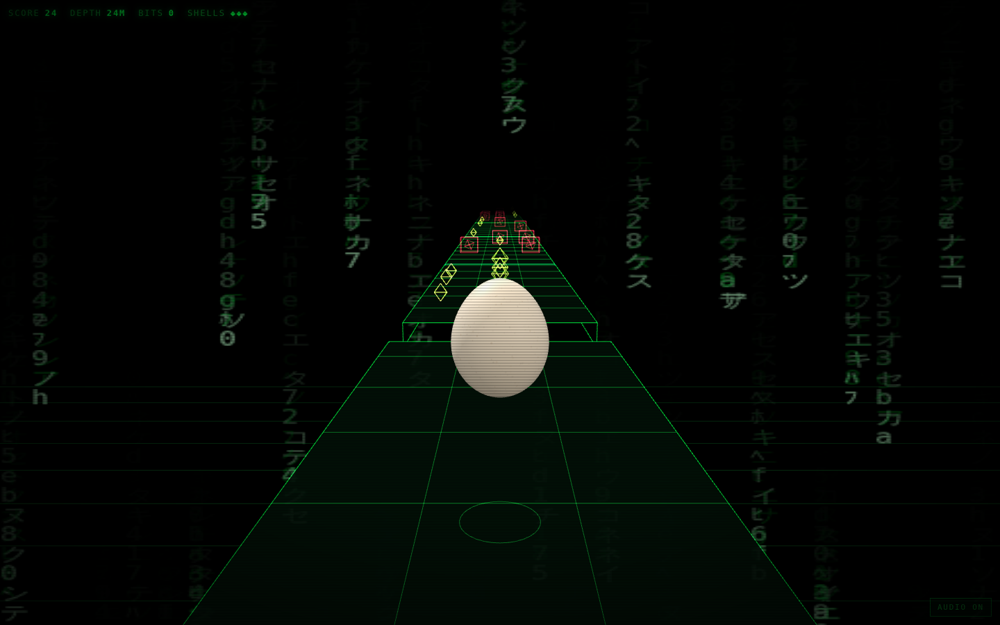
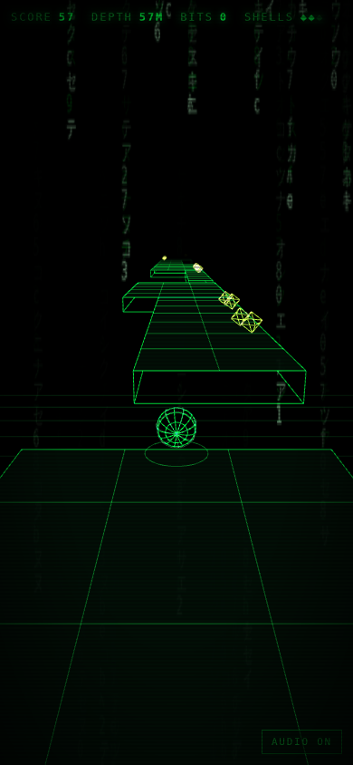

# Eggscape the Matrix

The egg got out. Everything on the other side is wireframe and green.

A 3D runner-platformer in the browser: roll east down a course that builds
itself, jump the holes, weave the agents, take the bits.

The egg is [Marc's](https://github.com/h1ddenpr0cess20/marc), as he is — the
same 128×96 shell through the same `shapeEgg` profile, the same 900-speckle
cream skin, the same physical material with its clearcoat and sheen, lit by his
studio rig. He is the only thing in here that is not made of lines, which is the
point.

He stays upright, too. The silhouette — fat end down, narrow end up — is the
asset, so he rocks and turns on the spot instead of tumbling end over end, and
the squash spring is allowed to flatten him but barely to stretch him.



## Run

```sh
git clone https://github.com/h1ddenpr0cess20/eggscape
cd eggscape
npm install
npm run dev               # → http://localhost:5173
```

No API keys, no server, no account, and no libraries: it is a static page with
its own renderer — WebGPU where the browser has it, WebGL 2 where it does not.

## Play

| | |
|---|---|
| `A` `D` / `←` `→` | one lane, per press |
| `W` / `↑` / `space` | jump — again in the air for a flip |
| `S` / `↓` | slam down — onto an agent to break it |
| `M` | audio |

On a phone: swipe for a lane, flick up to jump, flick down to slam, tap for a
jump.

Three shells. An agent costs one, so does the void, and either way the egg is
put back down and keeps going until the last one. A metre is a point, a bit is
twenty-five, and an agent you come down on — in the air, slam on — is sixty and
one fewer agent. Speed climbs with distance, so the course gets harder because
you are getting faster, and the gaps grow to match.

The slam is the only move that answers back. Jump over an agent, put it on, and
the landing goes through the deck and takes the agent in that lane with it —
your lane only, and only a couple of metres of it, so it has to be aimed.

<p align="center">
  
</p>

## The soundtrack

There is no audio file in the repository, and there is music. `soundtrack.js`
writes it down — one token per sixteenth, `e2 - . e3+g3+b3` — and `music.js`
plays it on the same AudioContext the sound effects use, on instruments made
of oscillators and noise. Nothing is built until the page has had a touch,
because no browser will make a sound before one.

It is psytrance — the sequels cut their fights to Juno Reactor — which is a
kick on every beat and a bass rolling the three sixteenths between them, here
in E minor, round Em Em C C Am Am F B. The F is the trick. It sits a semitone above home, where nothing
that belongs in E minor lives, and it is what makes the loop sound like the
code is wrong.

It builds with depth. The first hundred metres are the kick and the bass. Then
come the hats, the clap and the green rain — square-wave plinks three to a
beat against four, so they never fall the same way twice in a bar — and at
three hundred the pads and the data bleeps, and at six hundred the lead. Every
layer comes in on a bar line, whatever metre it was earned on. An agent
muffles the lot for a second. System failure is a chord that is not in the key
and the power draining out of a saw; between runs it is the pod, the same
chords slowed right down, and a heartbeat.

The sequencer never plays anything at the moment it is asked to. It puts
notes down a quarter of a second ahead on the audio clock, so a frame that
hitches is not a note that arrives late — and further ahead than that when the
frames are coming slowly, since a phone that is struggling is struggling on
every one of them. A tab that comes back from the background drops what it
missed and stays on the grid, rather than playing a minute of music at once.
`M` mutes it with everything else, and it keeps time while it is off, so it
comes back on the beat.

## How it holds together

The run is a plain object graph with no pixels in it — course, egg, lives,
score — and the renderer reads a snapshot of it every frame. Nothing in
`src/core/` touches the GPU or the DOM, which is why a seed can be
played out headlessly in a test and asserted on.

```
index.html            Markup only — Vite's entry
src/
  main.js             The wiring, and nothing else
  styles.css          The HUD, and the CRT it pretends to be on
  core/               The game. No GPU, no DOM, no randomness it did not seed
    game.js             Lives, score, pickups, and real seconds → fixed ticks
    course.js           The course, laid a pattern at a time, ahead of the egg
    player.js           Gravity, lanes, jump, coyote time, landings
    tuning.js           Every number the run is tuned by — the course reads it too
    shape.js            Marc's egg profile, verbatim
    rng.js              A seeded stream, so a seed is a course
    motion.js           The spring and the chase everything eases on
    emitter.js
  render/             The Matrix, built out of gpu/. Reads snapshots, owns no game state
    scene.js            Renderer, camera, fog, backdrop, and the light for the egg
    view.js             Snapshot → scene graph, and the chase camera
    rig.js              Where that camera sits and what it looks at, as arithmetic
    egg.js              Marc, fitted to the collider
    shell.js            His geometry and material, carried over as they are
    skin.js             His speckled cream, painted onto a canvas
    environment.js      His studio, turned down and turned green
    props.js            Slabs, agents, bits, and the grid under the void
    rain.js             The backdrop, painted on a canvas
    materials.js        Four shared line materials
    theme.js            One colour, and the two warnings
  gpu/                The renderer. Knows nothing about eggs
    renderer.js         Picks WebGPU or WebGL 2, and draws a scene with either
    frame.js            What is visible, in what order, and every uniform byte
    webgpu.js           The WebGPU backend
    webgl.js            The WebGL 2 backend
    graph.js            Nodes, meshes, lines, lights, the camera
    geometry.js         Vertex data, and the spheres, cylinders and rings
    material.js         Lit, unlit and line materials, as plain data
    texture.js          A canvas and how to sample it
    environment.js      His studio, prefiltered into a ladder of blurs
    dfg.js              The table the specular highlight is read from
    math.js             Vectors and double-precision matrices
    color.js            sRGB in, linear light inside, sRGB out
    shaders/            The GLSL and the WGSL, one of each
  ui/
    hud.js              The readouts and the panel between runs
    input.js            Keys and swipes → one frame of intent
    sound.js            Four oscillators' worth of arcade
    music.js            A sequencer that reads its parts out of strings
    soundtrack.js       Psytrance in E minor, and a heartbeat for the title
    best.js             The only thing that survives a run
test/                 node:test, including an autopilot that proves seeds are fair
```

The generator never lays a gap wider than the jump that has to clear it, or a
step higher than the jump can rise: both come out of the same `tuning.js` the
physics uses, and the tests check every seed against them. Slabs never overlap
in z, so there is no wall to run into — miss a jump and you meet the void,
which is a fair thing to lose to.

One number in there is worth the warning it carries. `laneX` *descends* — lane
0 sits at the highest x — because the egg runs towards +z and the camera chases
it from behind, looking the same way, which mirrors the picture: world +x draws
on the left of the screen. Written the intuitive way round, every lane control
is backwards and nothing in the core notices. `test/rig.test.js` projects a
lane through the real rig and checks which half of the frame it lands on, which
is the only place the mistake is visible.

There is also an autopilot in `test/helpers/pilot.js`. It plays badly on
purpose — one frame of lookahead, no double jump — and the suite fails if it
cannot get a few hundred metres down a seed.

### It draws its own pixels

There is no 3D library in here. `src/gpu/` is a renderer written for this world
and nothing else: a scene graph, three shaders — lit, unlit, and the
backdrop — and two backends that draw them. WebGPU is tried first; a browser
without it, or one whose WebGPU will not start, gets WebGL 2, and
`?renderer=webgl` or `?renderer=webgpu` in the address picks one by hand. The
shaders are in `src/gpu/shaders/`, as `.glsl` for WebGL and `.wgsl` for
WebGPU, and they are the same shaders twice: change a constant in one and
change it in the other.

The two backends cannot disagree about what to draw, because neither of them
decides. `frame.js` walks the scene once a frame, culls it, sorts it — solid
things first, see-through things far to near — and packs every uniform into
blocks of vec4s and mat4s that std140 and WGSL lay out byte for byte the same.
A backend only says *draw this*. `test/gpu.test.js` reads the GLSL and the
WGSL and fails if either has drifted from what `frame.js` packs.

Everything in the world but the egg is one-pixel lines added onto the black,
and that is what the GPU draws them as — native lines, additive, faded into
the black by the fog before they are added, so a slab at a hundred metres is
a slab at a tenth of the brightness rather than a slab behind a curtain. The
deck under them is a black fill pushed a hair back in depth, so a rung on its
top surface is never fighting it for a pixel. The rain is a canvas stretched
over the whole frame behind everything, at a third of its brightness.

The lighting is the lighting Marc was made under, kept term for term: GGX specular with
multiple-scattering compensation read off the same DFG table, Charlie sheen
and the clearcoat on Marc's shell, fog mixed in after the encode. The
environment the lit surfaces reflect is prefiltered into a cube-UV ladder of
seven blurs by GGX importance sampling — on the CPU, in a worker, because the
cube is sixteen texels a side — and the shaders pick a rung by roughness
through the same curve as before. Rendered side by side with the build that
used a library, frame for frame down a seeded run, the WebGL picture agrees
with it to within one level in 255, and the WebGPU one differs only in which
pixels along an antialiased edge get a sample.

| Script | |
|---|---|
| `npm run dev` | Vite |
| `npm run build` | Bundles to `dist/` |
| `npm run preview` | Serves the build |
| `npm test` | `node:test` over the core, the renderer, the HUD, the page and the music |
| `npm run lint` | ESLint |

CI runs the lint, the tests on Node 22.12 and 24, and a build that then has to
boot and serve itself.
